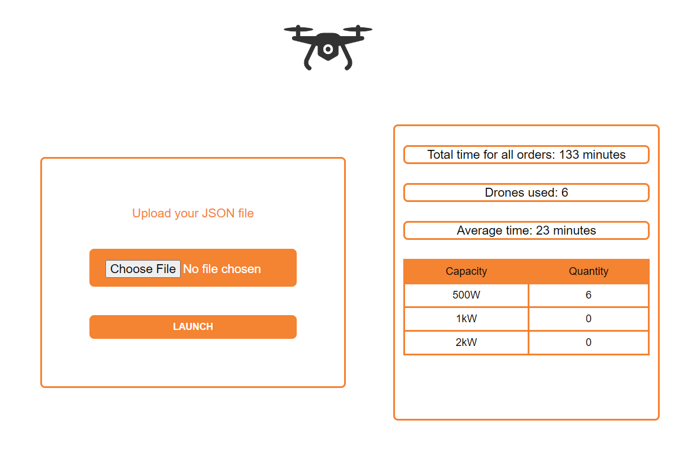

## Introduction

This project was part of an assignment when I applied for an internship as an intern web developer at ' Nemetschek ' company. I had to create an application to simulate deliveries of products with drones.As it had to be calculated: the final time for all deliveries, how many drones were used for deliveries, what type of drones were used, the average delivery time, the current status of each order, the current status of each drone. As input data we get a JSON format file.

## Requirements

For helping the municipality with the initial research, a rough estimate of delivery time is enough. Therefore the movement speed can be considered constant and equal to a single unit in the map for a minute (for example, the drone travels the distance from point (0,0) to the point (0, 1) for one minute). 

## Research and Considerations
- A significant research have to be made about the types of drones, their prices and other characteristics like the battery capacity and consumption.
- Drone batteries are assumed to be sufficient for deliveries during the day and are recharged during the night inside warehouses.
- Time needed to stay at warehouse to pick the next order is assumed to be about 5 minutes.
- Orders, when delivered, could be left in front of the customer's door without waiting for customer interaction.
- Warehouses are assumed to have unlimited quantities from all products.
- At any given time, a drone can carry only a single delivery of all the products inside it.

## Tasks
### a) Basic Drones - Time
Our first task is to deliver an application to the mayor that, given the warehouses and customer locations as well as a list of different customer orders, returns the total time needed to deliver all orders.

### b) Basic Drones - Drones Used
Together with the total time, the number of drones used for deliveries is needed to estimate the resources needed.

### c) Drone Charging - Consume Only When Move
Develop an extension of the application to configure battery capacity and power consumption of drones. 

### d) Program Output Real-time
The program should be configured to play X program minutes for Y real-life milliseconds and display the entire flow of the program.

### e) Add New Order
Customers should be able to enter a new order while the program is running.

### f) Basic Drones - Average Time
Return the average time for an order to be delivered.

### g) Add New Order
Users should be able to enter a new order through a configuration file while the program is running in real-time mode.

### h) All Orders Status
Provide a way to see statuses of all orders in the second program.

### i) Drone Charging - Consume for Each Kilogram Taken
Accommodate a new type of drone with power consumption based on carried load.

### j) Charging Stations Network
Explore the options of charging stations and its impact on deliveries.

